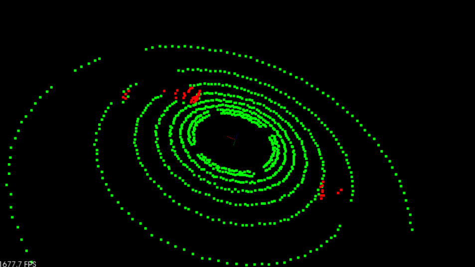
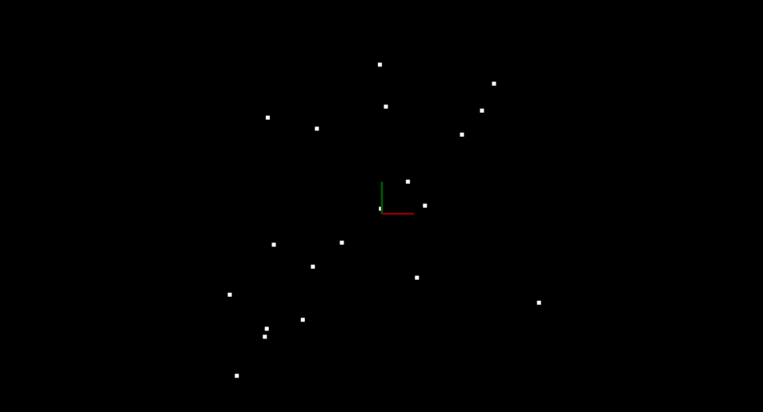
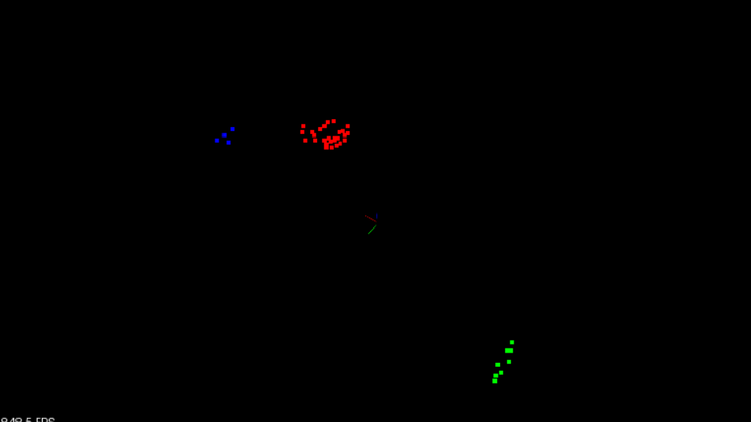

# Lidar Obstacle Detection


**Lidar** sensing gives us high resolution data by sending out thousands of laser signals. These lasers bounce off objects, returning to the sensor where we can then determine how far away objects are by timing how long it takes for the signal to return. Also we can tell a little bit about the object that was hit by measuring the intesity of the returned signal. Each laser ray is in the infrared spectrum, and is sent out at many different angles, usually in a 360 degree range. While lidar sensors gives us very high accurate models for the world around us in 3D, they are currently very expensive, upwards of $60,000 for a standard unit.

Now, to detect object we create a pipeline as follows:

1. **Segmentation------>**

	We used 3D RANSAC algorithm to segment point cloud data and seperate it into points that are part of the road and the points that are not.
	
	

	RANSAC stands for Random Sample Consensus, and is a method for detecting outliers in data. RANSAC runs for a max number of iterations, and returns the model with the best fit. Each iteration 		randomly picks a subsample of the data and fits a model through it, such as a line or a plane. Then the iteration with the highest number of inliers or the lowest noise is used as the best model.
	
	

	One type of RANSAC version selects the smallest possible subset of points to fit. For a line, that would be two points, and for a plane three points. Then the number of inliers are counted, by 		iterating through every remaining point and calculating its distance to the model. The points that are within a certain distance to the model are counted as inliers. The iteration that has the 		highest number of inliers is then the best model. 

	Other methods of RANSAC could sample some percentage of the model points, for example 20% of the total points, and then fit a line to that. Then the error of that line is calculated, and the 		iteration with the lowest error is the best model. This method might have some advantages since not every point at each iteration needs to be considered.

	An example is given below:
	The data shown below was generated by creating a line with points slightly scattered, and then outliers were added by randomly placing points in the scene. You want to be able to identify which 		points belong to the line that was originally generated and which points are outliers. To do this you will randomly sample two points from the cloud and fit a line between the points
	
	

	Equation of a Line Through Two Points in 2D

	For variables x and y and coefficients A, B, and C, the general equation of a line is: 
	Ax + By + C=0
	Given two points: point1 (x1, y1) and point2 (x2, y2), the line through point1 and point2 has the specific form: 
	(y1 − y2)x + (x2 − x1)y + (x1∗y2 − x2∗y1) = 0

	After fitting the line you can then iterate through all the points and determine if they are inliers by measuring how far away each point is from the line. You can do this for each iteration 		keeping track of which fitted line had the highest number of inliers. The line with the most inliers will be the best model. The equation for calculating distance between a point and line is shown 		below:

	Line formula Ax + By + C=0
    	Point (x,y)
    	Distance d = ∣Ax + By + C∣ / sqrt(A^2 + B^2)

	Below are the results of doing RANSAC to fit a line from the data above. Inliers are green while outliers are red. The function had a max iteration count of 50 and a distance tolerance of 0.5. The 		max iteration size to run depends on the ratio of inliers to the total number of points. The more inliers our data contains the higher the probability of selecting inliers to fit the line to, and 		the fewer iterations you need to get a high probability of selecting a good model.

	

	Now, in the same way we can extend RANSAC to planes --->
	Equation of a Plane through Three Points

	Ax + By + Cz + D=0
	
	For

    	point1 = (x1,y1,z1)
    	point2 = (x2,y2,z2)
    	point3 = (x3,y3,z3)

	Use point1point1point1 as a reference and define two vectors on the plane v1 and v2 as follows:

    	Vector v1 travels from point1 to point2
    	Vector v2 travels from point1 to point3

	v1 = <x2−x1, y2−y1, z2−z1>
	v2 = <x3−x1, y3−y1, z3−z1>

	Find normal vector to the plane by taking cross product of v1×v2v1: 

	v1×v2 = <(y2−y1)(z3−z1) − (z2−z1)(y3−y1), 
		 (z2−z1)(x3−x1) − (x2−x1)(z3−z1), 
		 (x2−x1)(y3−y1) − (y2−y1)(x3−x1)>

	To simplify notation we can write it in the form v1×v2=<i,j,k>

	then ,

	i(x − x1) + j(y − y1) + k(z − z1) = 0,
	ix + jy + kz − (ix1 + jy1 + kz1) = 0

	A = i,

	B = j,

	C = k,

	D = −(ix1 + jy1 + kz1)

	Distance between point and plane:

	If the plane is Ax + By + Cz + D=0, then given a point (x,y,z) the distance from the point to the plane is: d = ∣A∗x + B∗y + C∗z + D∣/sqrt(A2 + B2 + C2).


2. **Clustering------->**
	
	Clustering means - grouping bunch of points that are close together. One way to do that grouping and cluster point cloud data is called euclidean clustering. 
	
	**Euclidean Clustering**:
	The idea is you associate groups of points by how close together they are. To do a nearest neighbor search efficiently, you use a KD-Tree data structure which, on average, speeds up your look up 		time from O(n) to O(log(n)). This is because the tree allows you to better break up your search space. By grouping points into regions in a KD-Tree, you can avoid calculating distance for possibly 		thousands of points just because you know they are not even considered in a close enough region.

	

	**KD-Tree:**
	A KD-Tree is a binary tree that splits points between alternating axes. By separating space by splitting regions, nearest neighbor search can be made much faster when using an algorithm like 		euclidean clustering.

	

	The image above shows what the 2D points look like. In this simple example there are only 11 points, and there are three clusters where points are in close proximity to each other.
	The image below shows line separations, with blue lines splitting x regions and red lines splitting y regions. The image shows what the tree looks like after all 11 points have been inserted.

	


3. **Bounding Box------->**	

	As a final touch, we can add bounding boxes around the clusters. The bounding box volume could also be thought of as space the car is not allowed to enter, or it would result in a collision.
	
	

	The function BoundingBox looks at the min and max point values of an input cloud and stores those parameters in a box struct container. 


Combining the above mentioned steps will bring a beautiful algorithm to detect obstalce using Lidar.


	
## Installation

### Ubuntu 

```bash
$> sudo apt install libpcl-dev
$> cd ~
$> git clone https://github.com/udacity/SFND_Lidar_Obstacle_Detection.git
$> cd SFND_Lidar_Obstacle_Detection
$> mkdir build && cd build
$> cmake ..
$> make
$> ./environment
```


